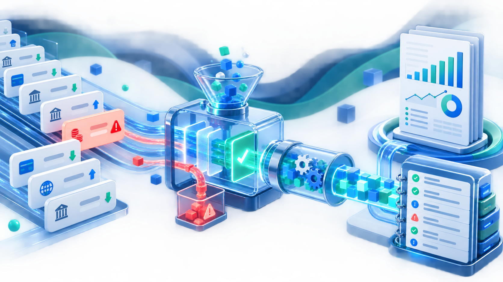

## Cómo trabajaremos hoy

INGENIERÍA BIOMÉDICA · SALUD DIGITAL · IA EMBEBIDA

Andreas Cardona

<ul class="compact-list"><li>Electrónica de adquisición y sistemas embebidos</li><li>IA y <em>deep learning</em> en microcontroladores</li><li>Python, C, bibliotecas de IA y <em>world models</em></li><li>Profesor de Circuitos Integrados en la UPC</li></ul>

IRIS · Onalabs · NTT DATA · Banc de Sang i Teixits

---

## La calidad hace que el código sea utilizable por un equipo

El código tiene calidad cuando una persona distinta puede <strong>entenderlo, ejecutarlo y confiar en su resultado</strong>.

Los datos cambian y el proceso debe seguir siendo válidoLos errores deben poder localizarse y explicarseLas reglas deben conservarse cuando el código evoluciona

---

## Qué resolveremos en esta sesión

01<strong>¿Qué debe validarse antes de procesar?</strong>
Contrato de entrada y política de incidencias.

02<strong>¿Cómo localizamos un fallo?</strong>
Excepciones específicas y logs con contexto.

03<strong>¿Cómo comprobamos que el resultado esperado se mantiene?</strong>
Funciones separadas, copias y <code>assert</code>.

04<strong>¿Cómo lo trasladamos a un equipo?</strong>
Un pipeline reutilizable y un resumen inspeccionable.

Al terminar podrás convertir código heredado en una primera versión operable.

---

## La calidad básica es el punto de partida, no el final

REPASO RÁPIDO

La legibilidad reduce el coste de entender y cambiar el código.

<strong>Nombres</strong><code>importe_total</code>, no <code>x</code>

<strong>Funciones</strong><code>limpiar_operaciones(df)</code>

<strong>Formato (PEP 8)</strong>Sangría, espacios y líneas fáciles de leer

<strong>Tipos y <em>docstrings</em></strong>qué entra, qué sale y por qué

<strong>Sin efectos laterales</strong><code>datos = df.copy()</code>

<strong>Tests</strong><code>assert</code> sobre reglas importantes

<strong>Hoy:</strong> calidad de ejecución — qué ocurre cuando el pipeline recibe datos reales, falla, se reejecuta o cambia de manos.

---

## Un informe que “no se pudo generar” no ayuda a nadie

MENSAJE HEREDADO
<code>El informe no se ha podido generar</code>

PREGUNTA PROFESIONAL

¿Se puede publicar el informe?

Si no, ¿quién debe actuar y con qué evidencia?

Faltan etapa, causa, filas afectadas y una acción siguiente.

---

## No todas las incidencias se tratan igual

CONTINUAR · INFO<strong>Inicio, fin y métricas</strong>
Contexto de una ejecución correcta.

NORMALIZAR · WARNING<strong>Canal no reconocido</strong>
Convertir a <code>otro</code> y dejar evidencia.

EXCLUIR · WARNING<strong>Fecha, cliente o importe inválido</strong>
Excluir, contar y comunicar la pérdida.

DETENER · ERROR<strong>Falta una columna obligatoria</strong>
<code>ContratoDatosError</code>: no se puede interpretar el dataset.

La escala une acción y severidad: <code>INFO</code> informa; <code>WARNING</code> permite continuar dejando evidencia; <code>ERROR</code> detiene el proceso porque no hay un resultado fiable.

---

## <code>print()</code> sirve para explorar; logging sirve para operar

DURANTE UNA EXPLORACIÓN
<pre><code class="language-python">print("filas descartadas:", filas_descartadas)</code></pre>
Rápido y útil mientras pensamos.

No tiene nivel, destino persistente ni contexto suficiente si el proceso se ejecuta sin supervisión.

DENTRO DE UN PIPELINE
<pre><code class="language-python">logger.warning(
    "Filas excluidas | filas=%d", filas_descartadas
)</code></pre>
Puede filtrarse, guardarse, buscarse y relacionarse con una etapa concreta.

---

## Un pipeline profesional separa responsabilidades

01<strong>Validar</strong>
¿Puedo interpretar el dataset?

02<strong>Diagnosticar</strong>
¿Qué incidencias hay?

03<strong>Limpiar</strong>
¿Qué filas conservo?

04<strong>Clasificar</strong>
¿Qué regla aplico?

05<strong>Resumir</strong>
¿Qué resultado entrego?

06<strong>Verificar</strong>
¿Se mantiene el contrato?

---

## Refactorizar también es proteger el comportamiento

LA REGLA

Una mejora no debe cambiar accidentalmente el informe.

Las copias evitan efectos laterales; los tests convierten reglas de negocio en expectativas verificables.

<pre><code class="language-python">entrada = operaciones.copy(deep=True)
resultado = clasificar_revision(entrada)

assert_frame_equal(entrada, operaciones)
assert resultado["importe"].ge(0).all()</code></pre>

---

## Logging responde a preguntas que <code>print()</code> no puede sostener

INFO<strong>¿Qué etapa se ha completado?</strong>
Inicio, fin, métricas y resultado.

WARNING<strong>¿Qué se corrigió, pero permite continuar?</strong>
Filas excluidas, canales normalizados y calidad degradada.

ERROR<strong>¿Qué impide un resultado fiable?</strong>
Contratos incumplidos y fuentes no disponibles.

El mismo logger puede informar en pantalla durante el desarrollo y dejar auditoría en fichero durante una ejecución nocturna.

---

## Del criterio al código {background-color="#003b5c" .section-divider}

La calidad no se añade al final: se diseña en cada etapa del pipeline.

---

## En el notebook veremos

01<strong>Diagnosticar</strong>
Ejecutamos el código heredado e identificamos qué información falta para resolver la incidencia.

02<strong>Construir</strong>
Recorremos validación, limpieza, clasificación, logging y resumen.

03<strong>Verificar</strong>
El sanity check comprueba que la entrada no cambia y que el resultado es coherente.

Pregunta de control: ¿publicarías este informe con 4 filas excluidas de 400?

---

## Práctica: recuperar el informe diario

01<strong>Decidir</strong>
Convertir las incidencias de calidad en una decisión de publicación.

02<strong>Priorizar</strong>
Asignar prioridades con reglas vectorizadas sin modificar la entrada.

03<strong>Trazar</strong>
Elegir niveles de log y comprobar el contrato de datos.

04<strong>Proteger</strong>
Extraer reglas reutilizables y comprobar casos límite con <code>assert</code>.

Primero desde la celda vacía; después, si hace falta, con la ayuda desplegable.

---

## Cierre: la robustez se diseña

La robustez no evita todos los datos incorrectos: hace visibles las decisiones y permite explicar el resultado.

01<strong>Contrato claro</strong>
Sabemos qué datos son necesarios antes de procesarlos.

02<strong>Decisiones trazables</strong>
Podemos explicar qué se corrigió, excluyó o detuvo.

03<strong>Resultado verificable</strong>
Protegemos las reglas que no deben cambiar.

Antes de optimizar, desplegar o ampliar: ¿qué valida?, ¿qué registra y qué protege este proceso?

---

## Muchas Gracias {background-color="#003b5c" .section-divider}

